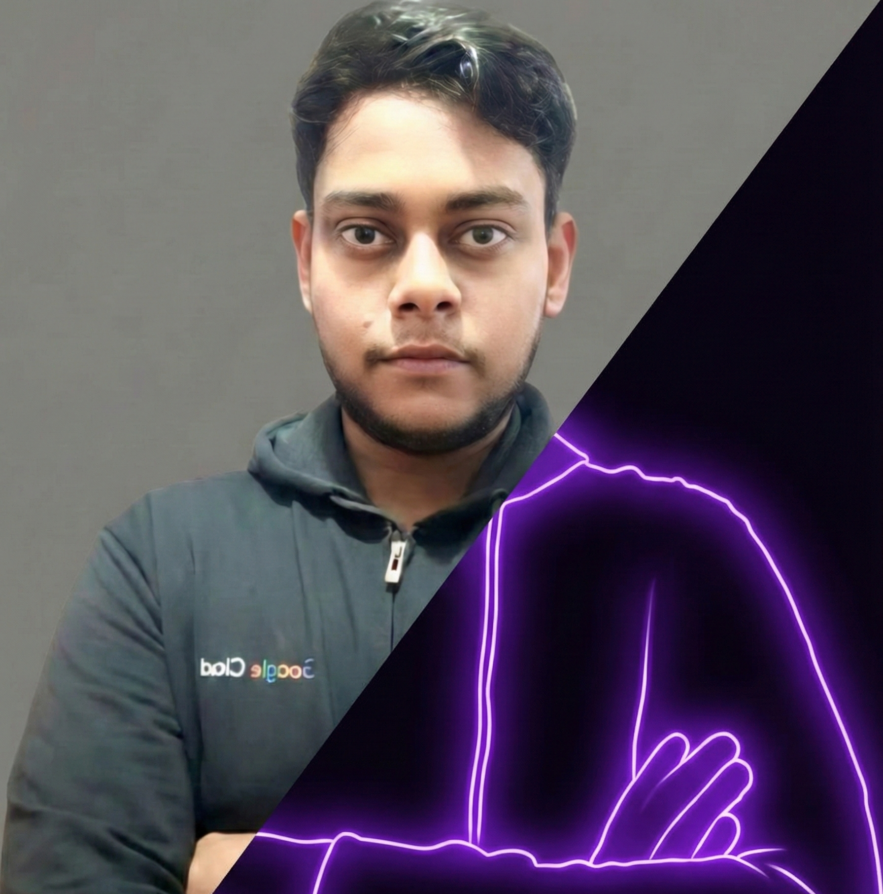

# Devansh Sharma — AI Engineer & Full-Stack Developer

<div align="center">



[](https://nextjs.org)
[](https://typescriptlang.org)
[](https://tailwindcss.com)
[](https://www.framer.com/motion)
[](https://vercel.com)

**Building production-grade AI systems, autonomous agents, RAG pipelines, and scalable full-stack applications.**

[🌐 Live Site](https://your-portfolio.vercel.app) · [📧 Email](mailto:devansh28sharma@gmail.com) · [💼 LinkedIn](https://www.linkedin.com/in/devansh-sharma28/) · [🐙 GitHub](https://github.com/Elvis280)

</div>

---

## ✨ Features

- **Tech Loader** — Full-screen boot sequence with matrix rain, glitch text, and terminal output
- **Sections** — Hero · About · Skills · Projects · Experience · AI Lab · Contact
- **Dark / Light Mode** — System-aware with manual toggle via `next-themes`
- **Typewriter Effect** — Rotating role titles with smooth type-and-delete animation
- **Download CV** — One-click resume download from Hero and Navigation
- **Framer Motion** — Page-wide scroll-triggered animations and micro-interactions
- **Fully Responsive** — Mobile-first layout with hamburger navigation

---

## 🛠️ Tech Stack

| Layer | Technology |
|---|---|
| Framework | [Next.js 16](https://nextjs.org) (App Router) |
| Language | TypeScript 5 |
| Styling | Tailwind CSS v4 |
| Animations | Framer Motion 12 |
| Icons | Lucide React |
| Theming | next-themes |
| Fonts | Inter (Google Fonts via next/font) |
| Deployment | Vercel |

---

## 🚀 Getting Started

### Prerequisites

- Node.js ≥ 18
- npm / yarn / pnpm

### Installation

```bash
# Clone the repo
git clone https://github.com/Elvis280/portfolio-v2.git
cd portfolio-v2

# Install dependencies
npm install

# Start the development server
npm run dev
```

Open [http://localhost:3000](http://localhost:3000) in your browser.

### Build for Production

```bash
npm run build
npm run start
```

---

## 📁 Project Structure

```
portfolio-v2/
├── app/
│   ├── globals.css        # Global styles + Tailwind v4 config
│   ├── layout.tsx         # Root layout with ThemeProvider
│   └── page.tsx           # Main page with Loader
├── components/
│   ├── Navigation.tsx     # Sticky nav with dark-mode toggle & CV download
│   ├── Hero.tsx           # Landing section with typewriter + CTAs
│   ├── About.tsx          # Bio, stats, career highlights
│   ├── Skills.tsx         # Tech stack grid
│   ├── Projects.tsx       # Featured + compact project cards
│   ├── Experience.tsx     # Timeline + certificates
│   ├── AIPlayground.tsx   # AI systems showcase
│   ├── Contact.tsx        # Contact CTA + social links
│   ├── Footer.tsx         # Footer
│   ├── Loader.tsx         # Boot-sequence loader
│   └── Icons.tsx          # Custom SVG icons
├── lib/
│   └── data.ts            # All content (personalInfo, projects, experience…)
└── public/
    ├── Dev.png                   # Avatar image
    ├── Devansh_Sharma_CV.pdf     # Resume / CV  ← place yours here
    ├── images/                   # Project screenshots
    └── certificates/             # Certificate images
```

---

## 🎨 Customisation

All content lives in **[`lib/data.ts`](lib/data.ts)** — update it to make the portfolio yours:

```ts
export const personalInfo = {
  name: "Your Name",
  email: "you@example.com",
  github: "https://github.com/yourhandle",
  cv: "/Your_Name_CV.pdf",   // drop PDF in /public
  // …
};
```

To change the **accent colours**, edit the Tailwind classes in each component. The primary palette uses:
- **Cyan** `#00d2ef` — primary accent  
- **Violet** `#8d54ff` — secondary accent  
- **Zinc** scale — backgrounds and text

---

## 📄 Adding Your CV

1. Export your resume as a PDF
2. Rename it to `Devansh_Sharma_CV.pdf` (or change the filename in `lib/data.ts` → `personalInfo.cv`)
3. Drop it into the `/public/` folder
4. The "Download CV" button in the Hero and Navigation will serve it automatically

---

## 🚢 Deployment

[](https://vercel.com/new/clone?repository-url=https://github.com/Elvis280/portfolio-v2)

Or deploy manually:

```bash
npm i -g vercel
vercel
```

---

## 📝 License

MIT © [Devansh Sharma](https://github.com/Elvis280)
